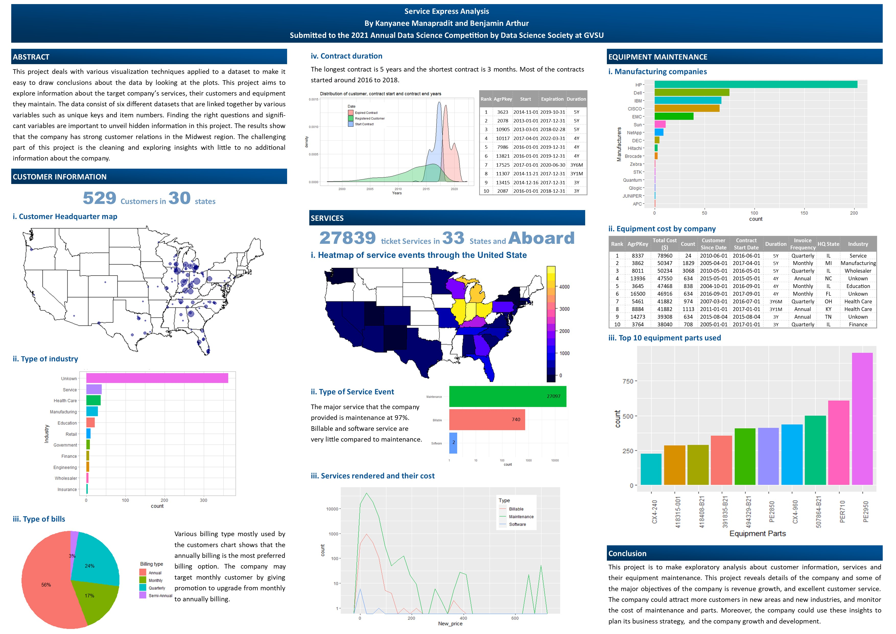

The visualization below is an example focusing on customer information, services, and equipment maintenance. During the summer, I teamed up with Benjamin to participate in the GVSU annual data contest 2021 hosted by the data science society. After receiving the dataset, we communicated and planned on how to work on this large dataset. We used R to write a report and created visualizations for business decision-making. Our hard work paid off, and we won the best overall analysis from the competition. 

```{r, echo=FALSE}

```

<br>
<br>

We also made it on a [PCEC News](https://www.gvsu.edu/pcec/module-news-view.htm?siteModuleId=10C50351-C8AB-9FB6-A8085CEAD21C2DA5&storyId=362B7EBE-BA0A-707E-D1136F17B3AA7541). 

{width=50%}